## Stock Market Data Analysis Project
We will try to answer the following questions:
1. What was the change in price of the stock over time?
2. What was the daily return of the stock on average?
3. What was the moving average of the various stocks?
4. What was the correlation between different stocks' closing prices?
4. What was the correlation between different stocks' daily returns?
5. How much value do we put at risk by investing in a particular stock?
6. How can we attempt to predict future stock behavior?

    import pandas as pd
    from pandas import Series, DataFrame
    import numpy as np
    
    #For Visualization
    import matplotlib.pyplot as plt
    import seaborn as sns
    sns.set_style('whitegrid')
    %matplotlib inline
    

    #For Reading stock data from yahoo finance
    from pandas.io.data import DataReader

    from datetime import datetime

    from __future__ import division

    #We will use the stocks of APPLE, GOOGLE, MICROSOFT and AMAZON for analysis
    tech_list = ['AAPL', 'GOOG', 'MSFT', 'AMZN']

    #End and start date for grabbing the stock data
    end = datetime.now()
    
    start = datetime(end.year-1, end.month, end.day)

    for stock in tech_list:
        globals()[stock] = DataReader(stock, 'yahoo', start, end)

Let's check out APPL DataFrame now.

    AAPL.head()

<table border="1" class="dataframe">
  <thead>
    <tr style="text-align: right;">
      <th></th>
      <th>Open</th>
      <th>High</th>
      <th>Low</th>
      <th>Close</th>
      <th>Volume</th>
      <th>Adj Close</th>
    </tr>
    <tr>
      <th>Date</th>
      <th></th>
      <th></th>
      <th></th>
      <th></th>
      <th></th>
      <th></th>
    </tr>
  </thead>
  <tbody>
    <tr>
      <th>2014-07-29</th>
      <td>99.330002</td>
      <td>99.440002</td>
      <td>98.250000</td>
      <td>98.379997</td>
      <td>43143000</td>
      <td>96.683405</td>
    </tr>
    <tr>
      <th>2014-07-30</th>
      <td>98.440002</td>
      <td>98.699997</td>
      <td>97.669998</td>
      <td>98.150002</td>
      <td>33010000</td>
      <td>96.457376</td>
    </tr>
    <tr>
      <th>2014-07-31</th>
      <td>97.160004</td>
      <td>97.449997</td>
      <td>95.330002</td>
      <td>95.599998</td>
      <td>56843000</td>
      <td>93.951349</td>
    </tr>
    <tr>
      <th>2014-08-01</th>
      <td>94.900002</td>
      <td>96.620003</td>
      <td>94.809998</td>
      <td>96.129997</td>
      <td>48511000</td>
      <td>94.472207</td>
    </tr>
    <tr>
      <th>2014-08-04</th>
      <td>96.370003</td>
      <td>96.580002</td>
      <td>95.169998</td>
      <td>95.589996</td>
      <td>39958000</td>
      <td>93.941519</td>
    </tr>
  </tbody>
</table>

    AAPL.describe()

<table border="1" class="dataframe">
  <thead>
    <tr style="text-align: right;">
      <th></th>
      <th>Open</th>
      <th>High</th>
      <th>Low</th>
      <th>Close</th>
      <th>Volume</th>
      <th>Adj Close</th>
    </tr>
  </thead>
  <tbody>
    <tr>
      <th>count</th>
      <td>252.000000</td>
      <td>252.000000</td>
      <td>252.000000</td>
      <td>252.000000</td>
      <td>2.520000e+02</td>
      <td>252.000000</td>
    </tr>
    <tr>
      <th>mean</th>
      <td>116.164484</td>
      <td>117.132064</td>
      <td>115.079088</td>
      <td>116.085714</td>
      <td>5.226927e+07</td>
      <td>115.370904</td>
    </tr>
    <tr>
      <th>std</th>
      <td>11.867873</td>
      <td>11.853083</td>
      <td>11.767821</td>
      <td>11.806810</td>
      <td>2.062401e+07</td>
      <td>12.234660</td>
    </tr>
    <tr>
      <th>min</th>
      <td>94.260002</td>
      <td>94.820000</td>
      <td>93.279999</td>
      <td>94.480003</td>
      <td>1.447960e+07</td>
      <td>93.312514</td>
    </tr>
    <tr>
      <th>25%</th>
      <td>105.097499</td>
      <td>105.487499</td>
      <td>104.604997</td>
      <td>105.192501</td>
      <td>3.841730e+07</td>
      <td>103.892638</td>
    </tr>
    <tr>
      <th>50%</th>
      <td>118.225003</td>
      <td>119.180000</td>
      <td>116.735000</td>
      <td>118.629997</td>
      <td>4.784885e+07</td>
      <td>117.672131</td>
    </tr>
    <tr>
      <th>75%</th>
      <td>127.142502</td>
      <td>127.907497</td>
      <td>125.982502</td>
      <td>126.912502</td>
      <td>6.082465e+07</td>
      <td>126.599998</td>
    </tr>
    <tr>
      <th>max</th>
      <td>134.460007</td>
      <td>134.539993</td>
      <td>131.399994</td>
      <td>133.000000</td>
      <td>1.898463e+08</td>
      <td>132.539993</td>
    </tr>
  </tbody>
</table>

    AAPL.info()

    <class 'pandas.core.frame.DataFrame'>
    DatetimeIndex: 252 entries, 2014-07-29 to 2015-07-28
    Data columns (total 6 columns):
    Open         252 non-null float64
    High         252 non-null float64
    Low          252 non-null float64
    Close        252 non-null float64
    Volume       252 non-null int64
    Adj Close    252 non-null float64
    dtypes: float64(5), int64(1)
    memory usage: 13.8 KB
    

    #Let's check out the historical view of the closing price
    AAPL['Adj Close'].plot(legend=True, figsize=(10,4))

    <matplotlib.axes._subplots.AxesSubplot at 0x198f4390>

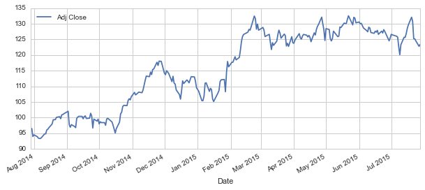

    #Now let's see the total volume of stocks being traded since the last year
    AAPL['Volume'].plot(legend = True, figsize = (10,4))

    <matplotlib.axes._subplots.AxesSubplot at 0x1989efd0>

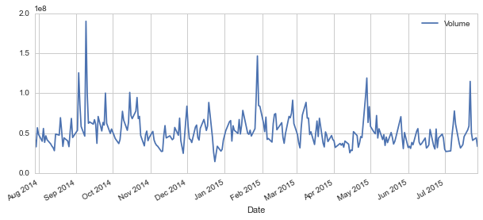

Now we will calculate the moving average of the Stock. 

    #Let's plot several moving averages
    ma_day = [10,20,50]
    
    for ma in ma_day:
        column_name = "MA for %s days" %(str(ma))
        AAPL[column_name] = pd.rolling_mean(AAPL['Adj Close'],ma)

    AAPL[['Adj Close', 'MA for 10 days','MA for 20 days', 'MA for 50 days']].plot(subplots=False, figsize=(10,4))

    <matplotlib.axes._subplots.AxesSubplot at 0x19bde828>

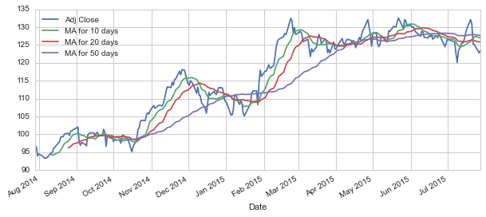

#### 2. Daily Return Analysis
Now we will analyze the risk of the stock

    AAPL['Daily Return']=AAPL['Adj Close'].pct_change()
    
    AAPL['Daily Return'].plot(figsize=(10,4), legend=True, linestyle='--', marker='o')

    <matplotlib.axes._subplots.AxesSubplot at 0x19bf3358>

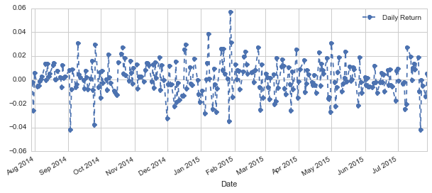

Let's take an overall look at the average daily retun using a histogram.

    sns.distplot(AAPL['Daily Return'].dropna(), bins=100, color = 'purple')

    <matplotlib.axes._subplots.AxesSubplot at 0x1a2df9e8>

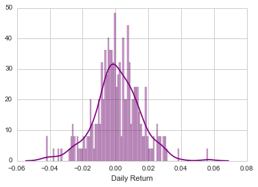

Now what if we wanted to analyze the returns of all the stocks in our list? Let's go ahead and build a DataFrame with all the ['Close'] columns for each of the stocks dataframes.

    closing_df = DataReader(tech_list,'yahoo', start, end)['Adj Close']

    closing_df.head()

<table border="1" class="dataframe">
  <thead>
    <tr style="text-align: right;">
      <th></th>
      <th>AAPL</th>
      <th>AMZN</th>
      <th>GOOG</th>
      <th>MSFT</th>
    </tr>
    <tr>
      <th>Date</th>
      <th></th>
      <th></th>
      <th></th>
      <th></th>
    </tr>
  </thead>
  <tbody>
    <tr>
      <th>2014-07-29</th>
      <td>96.683405</td>
      <td>320.000000</td>
      <td>585.612633</td>
      <td>42.760011</td>
    </tr>
    <tr>
      <th>2014-07-30</th>
      <td>96.457376</td>
      <td>322.510010</td>
      <td>587.422650</td>
      <td>42.457994</td>
    </tr>
    <tr>
      <th>2014-07-31</th>
      <td>93.951349</td>
      <td>312.989990</td>
      <td>571.602530</td>
      <td>42.048806</td>
    </tr>
    <tr>
      <th>2014-08-01</th>
      <td>94.472207</td>
      <td>307.059998</td>
      <td>566.072594</td>
      <td>41.756530</td>
    </tr>
    <tr>
      <th>2014-08-04</th>
      <td>93.941519</td>
      <td>313.649994</td>
      <td>573.152619</td>
      <td>42.253398</td>
    </tr>
  </tbody>
</table>

Now that we have all the closing prices, let's go ahead and get the daily return for all the stocks, like we did for the Apple stock.

    tech_rets = closing_df.pct_change()

Now we can compare the daily percentage return of two stocks to check how correlated. First let's see a sotck compared to itself.

    #Let's compare Google to itself.
    sns.jointplot('GOOG', 'GOOG', tech_rets, kind='scatter')

    <seaborn.axisgrid.JointGrid at 0x1c3264a8>

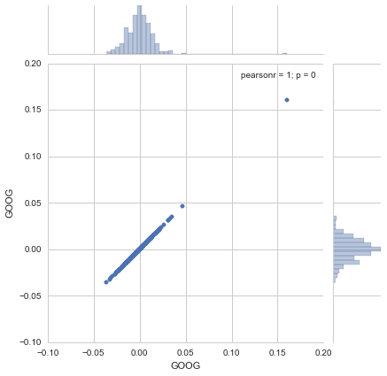

As we can see that stocks are positively correlated with each other (Linear Relationship)

    #Now we will compare the daily returns of Google and Microsoft

    sns.jointplot('GOOG', 'MSFT', tech_rets, kind = 'scatter')

    <seaborn.axisgrid.JointGrid at 0x1c6ebf98>

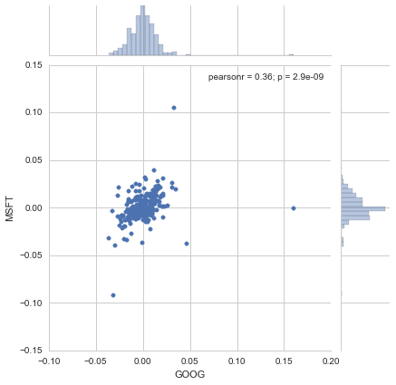

    # We can simply call pairplot on our DataFrame for an automatic visual analysis of all the comparisons
    sns.pairplot(tech_rets.dropna())

    <seaborn.axisgrid.PairGrid at 0x1c2046a0>

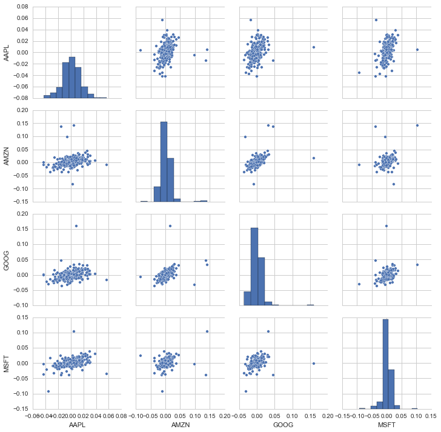

Above we can see all the relationships on daily returns between all the stocks. A quick glance shows an interesting correlation between Google and Amazon daily returns. It might be interesting to investigate that individual comaprison. While the simplicity of just calling sns.pairplot() is fantastic we can also use sns.PairGrid() for full control of the figure, including what kind of plots go in the diagonal, the upper triangle, and the lower triangle. Below is an example of utilizing the full power of seaborn to achieve this result.

    returns_fig = sns.PairGrid(tech_rets.dropna())
    
    returns_fig.map_upper(plt.scatter)
    
    returns_fig.map_lower(sns.kdeplot,cmap='cool_d')
    
    returns_fig.map_diag(plt.hist,bins=30)

    <seaborn.axisgrid.PairGrid at 0x20e2bcc0>

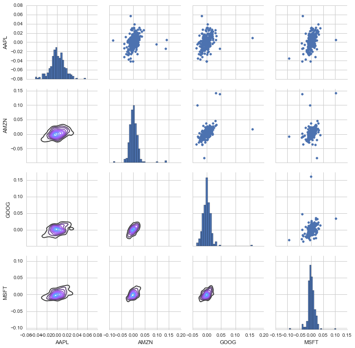

We could have also analyzed the correlation of the closing prices using this exact same technique. Here it is shown, the code repeated from above with the exception of the DataFrame called.

    returns_fig = sns.PairGrid(closing_df)
    
    returns_fig.map_upper(plt.scatter)
    
    returns_fig.map_lower(sns.kdeplot,cmap='cool_d')
    
    returns_fig.map_diag(plt.hist,bins=30)

    <seaborn.axisgrid.PairGrid at 0x2326d780>

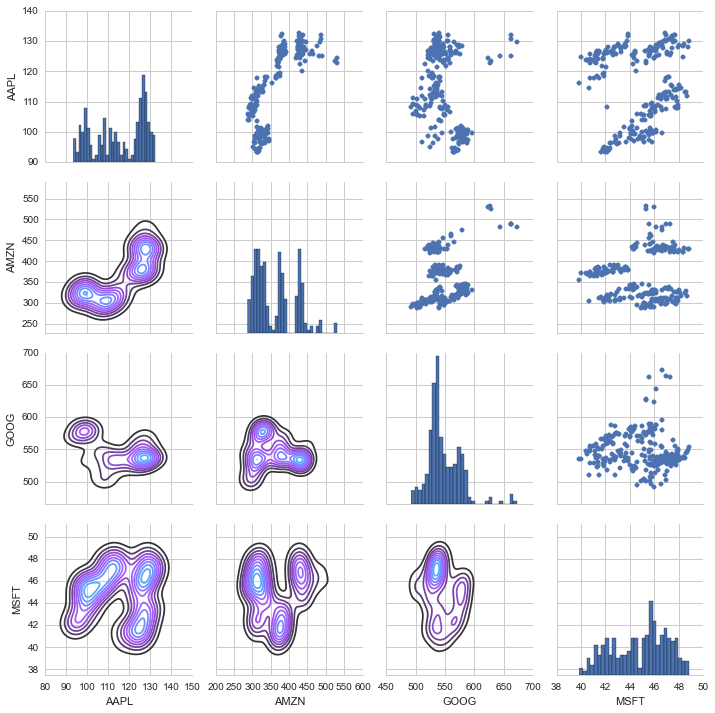

Finally, we could also do a correlation plot, to get actual numerical values for the correlation between the stocks' daily return values. By comparing the closing prices, we see an interesting relationship between Microsoft and Apple.

    sns.corrplot(tech_rets.dropna(),annot=True)

    C:\Anaconda\lib\site-packages\seaborn\linearmodels.py:1283: UserWarning: The `corrplot` function has been deprecated in favor of `heatmap` and will be removed in a forthcoming release. Please update your code.
      warnings.warn(("The `corrplot` function has been deprecated in favor "
    C:\Anaconda\lib\site-packages\seaborn\linearmodels.py:1349: UserWarning: The `symmatplot` function has been deprecated in favor of `heatmap` and will be removed in a forthcoming release. Please update your code.
      warnings.warn(("The `symmatplot` function has been deprecated in favor "
    

    <matplotlib.axes._subplots.AxesSubplot at 0x24515ac8>

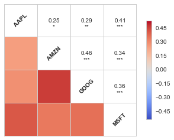

Fantastic! Just like we suspected in our PairPlot we see here numerically and visually that Amazon and Google had the strongest correlation of daily stock return. It's also interesting to see that all the technology comapnies are positively correlated.

Great! Now that we've done some daily return analysis, let's go ahead and start looking deeper into actual risk analysis.

###Risk Analysis
There are many ways we can quantify risk, one of the most basic ways using the information we've gathered on daily percentage returns is by comparing the expected return with the standard deviation of the daily returns.

    rets = tech_rets.dropna()
    
    area = np.pi*20
    
    plt.scatter(rets.mean(), rets.std(),alpha = 0.5,s =area)
    
    # Set the x and y limits of the plot (optional, remove this if you don't see anything in your plot)
    plt.ylim([0.01,0.025])
    plt.xlim([-0.003,0.004])
    
    #Set the plot axis titles
    plt.xlabel('Expected returns')
    plt.ylabel('Risk')
    
    # Label the scatter plots, for more info on how this is done, chekc out the link below
    # http://matplotlib.org/users/annotations_guide.html
    for label, x, y in zip(rets.columns, rets.mean(), rets.std()):
        plt.annotate(
            label, 
            xy = (x, y), xytext = (50, 50),
            textcoords = 'offset points', ha = 'right', va = 'bottom',
            arrowprops = dict(arrowstyle = '-', connectionstyle = 'arc3,rad=-0.3'))

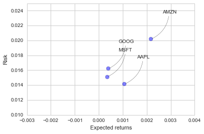

####Value at Risk

Let's go ahead and define a value at risk parameter for our stocks. We can treat value at risk as the amount of money we could expect to lose (aka putting at risk) for a given confidence interval. There are several methods we can use for estimating a value at risk. Let's go ahead and see some of them in action.

###Value at risk using the "bootstrap" method

Let's go ahead and repeat the daily returns histogram for Apple stock.

    sns.distplot(AAPL['Daily Return'].dropna(),bins=100,color='blue')

    <matplotlib.axes._subplots.AxesSubplot at 0x260e6cf8>

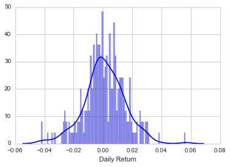

Now we can use quantile to get the risk value for the stock.

    # The 0.05 empirical quantile of daily returns
    rets['AAPL'].quantile(0.05)

    -0.023624679907673973

###Value at Risk using the Monte Carlo method
Using the Monte Carlo to run many trials with random market conditions, then we'll calculate portfolio losses for each trial. After this, we'll use the aggregation of all these simulations to establish how risky the stock is.

For more info on the Monte Carlo method for stocks, check out the following link: http://www.investopedia.com/articles/07/montecarlo.asp

To demonstrate a basic Monte Carlo method, we will start with just a few simulations. First we'll define the variables we'll be using the Google DataFrame GOOG

    # Set up our time horizon
    days = 365
    
    # Now our delta
    dt = 1/days
    
    # Now let's grab our mu (drift) from the expected return data we got for AAPL
    mu = rets.mean()['GOOG']
    
    # Now let's grab the volatility of the stock from the std() of the average return
    sigma = rets.std()['GOOG']

Next, we will create a function that takes in the starting price and number of days, and uses teh sigma and mu we already calculated form out daily returns

    def stock_monte_carlo(start_price,days,mu,sigma):
        ''' This function takes in starting stock price, days of simulation,mu,sigma, and returns simulated price array'''
        
        # Define a price array
        price = np.zeros(days)
        price[0] = start_price
        # Schok and Drift
        shock = np.zeros(days)
        drift = np.zeros(days)
        
        # Run price array for number of days
        for x in xrange(1,days):
            
            # Calculate Schock
            shock[x] = np.random.normal(loc=mu * dt, scale=sigma * np.sqrt(dt))
            # Calculate Drift
            drift[x] = mu * dt
            # Calculate Price
            price[x] = price[x-1] + (price[x-1] * (drift[x] + shock[x]))
            
        return price

    GOOG.head()

<table border="1" class="dataframe">
  <thead>
    <tr style="text-align: right;">
      <th></th>
      <th>Open</th>
      <th>High</th>
      <th>Low</th>
      <th>Close</th>
      <th>Volume</th>
      <th>Adj Close</th>
    </tr>
    <tr>
      <th>Date</th>
      <th></th>
      <th></th>
      <th></th>
      <th></th>
      <th></th>
      <th></th>
    </tr>
  </thead>
  <tbody>
    <tr>
      <th>2014-07-29</th>
      <td>588.752653</td>
      <td>589.702707</td>
      <td>583.517654</td>
      <td>585.612633</td>
      <td>1349900</td>
      <td>585.612633</td>
    </tr>
    <tr>
      <th>2014-07-30</th>
      <td>586.552650</td>
      <td>589.502696</td>
      <td>584.002627</td>
      <td>587.422650</td>
      <td>1016500</td>
      <td>587.422650</td>
    </tr>
    <tr>
      <th>2014-07-31</th>
      <td>580.602616</td>
      <td>583.652668</td>
      <td>570.002561</td>
      <td>571.602530</td>
      <td>2102800</td>
      <td>571.602530</td>
    </tr>
    <tr>
      <th>2014-08-01</th>
      <td>570.402584</td>
      <td>575.962633</td>
      <td>562.852520</td>
      <td>566.072594</td>
      <td>1955300</td>
      <td>566.072594</td>
    </tr>
    <tr>
      <th>2014-08-04</th>
      <td>569.042531</td>
      <td>575.352561</td>
      <td>564.102531</td>
      <td>573.152619</td>
      <td>1427300</td>
      <td>573.152619</td>
    </tr>
  </tbody>
</table>

    # Get start price from GOOG.head()
    start_price = 585.61
    
    for run in xrange(100):
        plt.plot(stock_monte_carlo(start_price,days,mu,sigma))
    plt.xlabel("Days")
    plt.ylabel("Price")  
    plt.title('Monte Carlo Analysis for Google')

    <matplotlib.text.Text at 0x26ec4dd8>

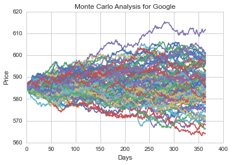

Let's go ahead and get a histogram of the end results for a much larger run. (note: This could take a little while to run , depending on the number of runs chosen)

    # Set a large numebr of runs
    runs = 10000
    
    # Create an empty matrix to hold the end price data
    simulations = np.zeros(runs)
    
    # Set the print options of numpy to only display 0-5 points from an array to suppress output
    np.set_printoptions(threshold=5)
    
    for run in xrange(runs):    
        # Set the simulation data point as the last stock price for that run
        simulations[run] = stock_monte_carlo(start_price,days,mu,sigma)[days-1];

Now that we have our array of simulations, we can go ahead and plot a histogram ,as well as use qunatile to define our risk for this stock.

    # Now we'lll define q as the 1% empirical qunatile, this basically means that 99% of the values should fall between here
    q = np.percentile(simulations, 1)
        
    # Now let's plot the distribution of the end prices
    plt.hist(simulations,bins=200)
    
    # Using plt.figtext to fill in some additional information onto the plot
    
    # Starting Price
    plt.figtext(0.6, 0.8, s="Start price: $%.2f" %start_price)
    # Mean ending price
    plt.figtext(0.6, 0.7, "Mean final price: $%.2f" % simulations.mean())
    
    # Variance of the price (within 99% confidence interval)
    plt.figtext(0.6, 0.6, "VaR(0.99): $%.2f" % (start_price - q,))
    
    # Display 1% quantile
    plt.figtext(0.15, 0.6, "q(0.99): $%.2f" % q)
    
    # Plot a line at the 1% quantile result
    plt.axvline(x=q, linewidth=4, color='r')
    
    # Title
    plt.title(u"Final price distribution for Google Stock after %s days" % days, weight='bold');

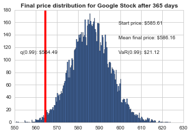

Awesome! Now we have looked at the 1% empirical quantile of the final price distribution to estimate the Value at Risk for the Google stock, which looks to be $21.12 for every investment of 585.61 (the price of one inital google stock).

Feel free to do more data analysis in this project

    
